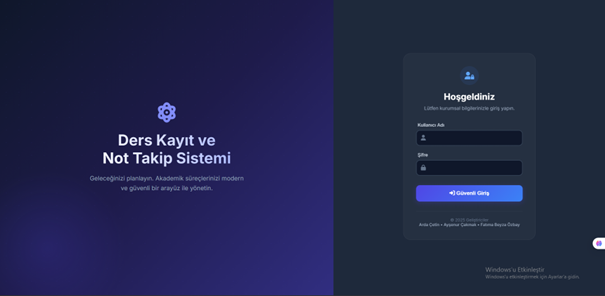

# 🎓 Course Registration and Grade Tracking System

This project is a **Course Registration and Grade Tracking System** developed to manage university course enrollment and grading processes in a structured and secure way.

It was developed as part of the **Database Systems** course.

---

## 📌 Project Overview

The system supports three different user roles:

- **Admin**
- **Student**
- **Instructor**

Each user can only perform actions within their authorization level.  
Role-based access control ensures data security and system integrity.

### Architecture & Technologies
- **Backend:** ASP.NET Core MVC
- **Database:** SQL Server
- **ORM:** Entity Framework Core
- **Frontend:** HTML, CSS, Bootstrap

---

## 👥 User Roles & Functionalities

### 🛠 Admin
- Add, update, delete students
- Add, update, delete instructors
- Add courses
- Assign instructors to courses
- Manage departments
- View student and instructor lists

---

### 🎓 Student
- View available courses
- Register for courses related to their department
- View grades (midterm, final, average, letter grade)
- Cannot register for the same course multiple times

---

### 👨‍🏫 Instructor
- View assigned courses
- View students enrolled in their courses
- Enter and update student grades

---

## 🔄 CRUD Operations

- **Create**
  - Student creation (Admin)
  - Course registration (Student)

- **Read**
  - Student listing
  - Grade viewing

- **Update**
  - Grade updates (Instructor)

- **Delete**
  - Student deletion (Admin)

---

## ⚠️ Challenges & Solutions

### Unauthorized Page Access
**Problem:** Users could access restricted pages via URL  
**Solution:** Session-based authorization checks were implemented.

### Duplicate Course Registration
**Problem:** Students could register for the same course multiple times  
**Solution:** Unique constraints in the database and validation checks in code.

### Null Reference Errors
**Problem:** Errors caused by uninitialized models or ViewBag usage  
**Solution:** Proper null checks and safer model handling.

---

## 🖼 Screenshots

> 📌 Screenshots are for demonstration purposes.

### Login Screen

### Admin Dashboard

### Student Course Registration

### Grade Entry (Instructor)

---

## 📂 Project Structure

