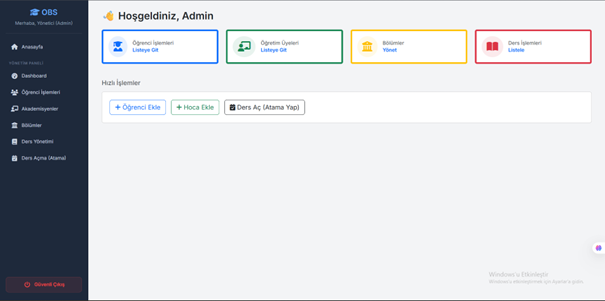
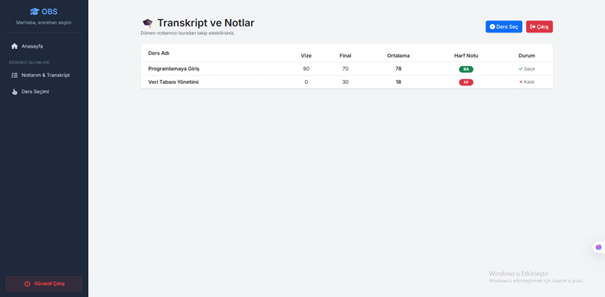

# Course Registration and Grade Tracking System

This project is a Course Registration and Grade Tracking System designed to manage university course enrollment and grading processes in a secure and structured manner.

The system is built with role-based access control and supports three user roles: Admin, Student, and Instructor. Each role can only perform actions within its authorization scope, ensuring data security and system integrity.

## Technologies
- ASP.NET Core MVC
- C#
- SQL Server
- Entity Framework Core
- HTML, CSS, Bootstrap

## User Roles and Features

### Admin
- Add, update, and delete students
- Add, update, and delete instructors
- Add courses
- Assign instructors to courses
- Manage departments
- View student and instructor lists

### Student
- View available courses
- Register for courses related to their department
- View grades (midterm, final, average, letter grade)
- Duplicate course registration is not allowed

### Instructor
- View assigned courses
- View students enrolled in their courses
- Enter and update student grades

## CRUD Operations
- **Create:** Student creation, course registration  
- **Read:** Student listing, grade viewing  
- **Update:** Grade updates  
- **Delete:** Student deletion  

## Challenges and Solutions
- Unauthorized page access was prevented using session-based authorization.
- Duplicate course registration was avoided using database-level constraints and validation checks.
- Null reference errors were resolved with proper model validation and safe data handling.

## Screenshots
> Screenshots are included to demonstrate the user interface and system flow.

## Project Purpose
This project was developed to demonstrate MVC architecture, database design, role-based authorization, and real-world CRUD operations using ASP.NET Core and SQL Server.

## Note
This project was developed for educational purposes.
